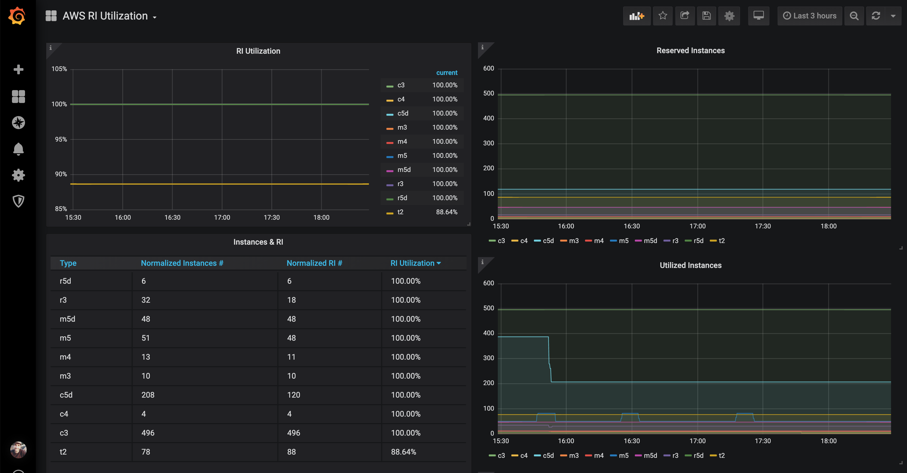

# AWS EC2 Reserved Instances Prometheus Exporter

To export as Prometheus metrics the utilization of our AWS EC2 Reserved Instances.



# Locally

```
docker run -v ~/.aws:/home/appuser/.aws -e AWS_REGION=us-west-2 -p 9900:9900 aws-ri-exporter:latest --namespace YOU_COMPANY_NAME
```

> NOTE: Bear in mind that you will have to change the hardcoded default namespace "cloud" on the "mixin" if you set an specific `--namepsace` on your deployment

# Development

## Run

There is a handy `Makefile` with few useful commands

```
✓ usage: make [target]

build                          - [Docker] Build docker image
run                            - [Golang] Start development server
test                           - [Golang] Run all tests
```

## Resources

- https://blog.cloudability.com/aws-101-reserved-instances
- https://docs.aws.amazon.com/AWSEC2/latest/UserGuide/apply_ri.html
- https://docs.aws.amazon.com/AWSEC2/latest/UserGuide/ri-modifying.html
- https://aws.amazon.com/about-aws/whats-new/2019/02/normalized-units-information-for-amazon-ec2-reservations-in-aws-cost-explorer

## Notes

- `ReservationId` have nothing to do with `Reserve Instances` check it out https://serverfault.com/questions/749118/aws-ec2-what-is-a-reservation-id-exactly-and-what-does-it-represent
